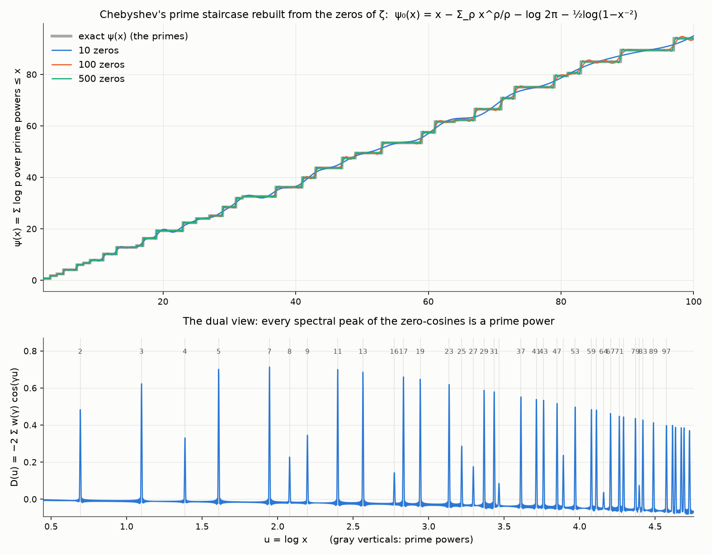
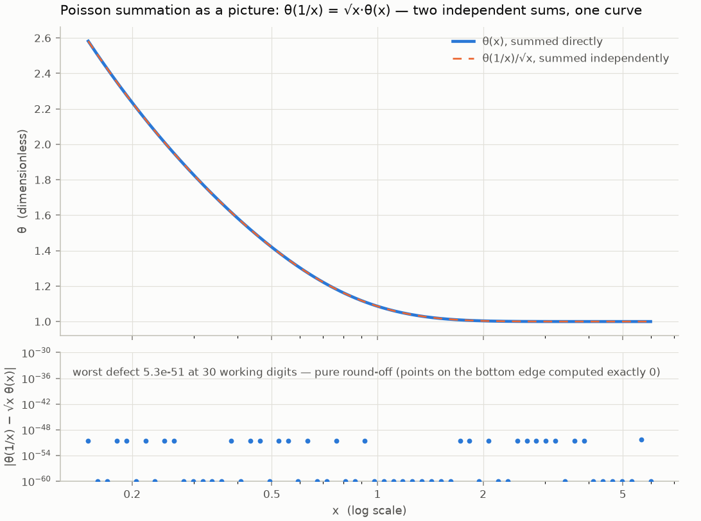
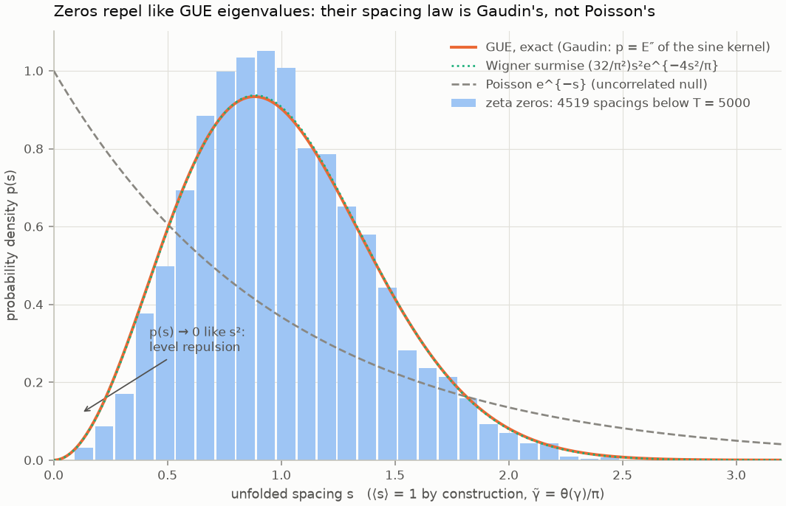
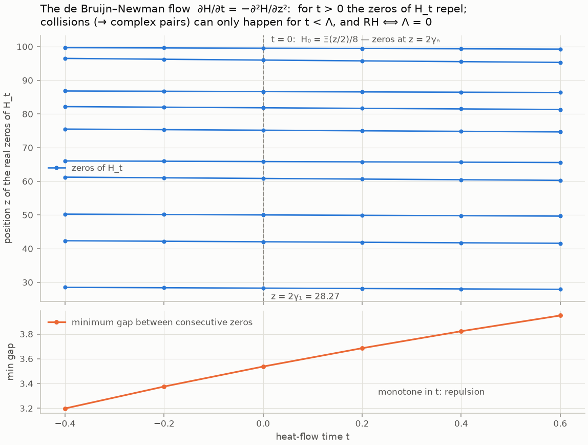

# Zeta — a computational laboratory for the Riemann Hypothesis

The non-trivial zeros of the Riemann zeta function encode, exactly, where the
prime numbers are — and the Riemann Hypothesis says all of those zeros lie on
a single vertical line. This repository is a working laboratory for that
statement: arbitrary-precision implementations of the classical machinery
(theta functions, the functional equation, Hardy's Z, the explicit formula,
GUE statistics, heat flow on Ξ, Weil positivity, the Davenport–Heilbronn
counterexample), each identity *measured* rather than assumed, with 486 tests
pinning every claimed number. In ninety seconds you can watch
the primes reconstructed from the zeros alone; in an afternoon you can read
why none of this computes its way to a proof.

## What this is (and is not)

This is an **instrument for building real intuition and real numerics about
RH** — for seeing the theorems happen, checking that formulas mean what you
think they mean, and calibrating what "evidence" is worth in this subject
(answer: nothing — see `docs/08-why-it-is-hard.md` for Littlewood's theorem
and the failure catalogue of every obvious route).

It is a **computational falsification laboratory** and research program
exploring prime-side spectral constructions for RH — not presently a proof. A
proof would require a natural prime-defined object, a non-circular trace or
spectral identification, and an intrinsic positivity or self-adjointness
theorem; numerical experiments here can reject candidates and validate
implementations, but cannot establish RH. The
house rule, from `docs/00-orientation.md`: *if a computation here appears to
settle something, the correct inference is that there is a bug.*

The laboratory has two certainty regimes. The numerical machinery in `zeta/`
is *accurate* (and `zeta/rigor.py` alone may say *certified*, for quantities
whose every step carried an enclosure). The second regime is new: `lean/` is
a Lean 4 + Mathlib project whose theorems are checked by a proof kernel —
not measured at all. It climbs a deliberate ladder: rung 1 (done) wires the
lab's ground-truth facts to their Mathlib proofs; rung 2 formalizes the κ
derivation behind the Davenport–Heilbronn counterexample; rung 3 targets the
Davenport–Heilbronn theorem itself — the certified statement that zeta-shaped
symmetry alone cannot give RH. Nothing in `lean/` counts until it compiles
with zero `sorry`s.

## Quickstart

```bash
cd Zeta
python3 -m venv .venv                # once (Python >= 3.11)
source .venv/bin/activate
pip install -e .
python scripts/06_tour.py            # the whole story in ~90 seconds, six acts
```

Every dependency is ordinary: `mpmath`, `numpy`, `scipy`, `matplotlib`,
`sympy` (see `pyproject.toml`). Expensive computations cache themselves under
`data/`, so second runs of everything are instant.

## Twelve things you can run right now

1. **Rebuild the primes from the zeros** — the moment the subject becomes real:

   ```bash
   python scripts/03_primes_from_zeros.py
   ```

   Von Mangoldt's explicit formula, live. Input: the first 500 zeros of ζ and
   *nothing else*. You will see ψ(100) converge from 98.16 (0 zeros) to
   94.03 (250 zeros; exact value 94.0453); a table of measured jumps showing
   the cosine sum jumping by log p exactly at 73, 79, 81 = 3⁴, 83, 89, 97 and
   staying flat at every composite in between; the edge at p = 97 sharpening
   as zeros are added; and the dual "music of the primes" spectrum with peaks
   at x = 2, 3, 5, … The zeros know where the primes are.

2. **Find every zero below height 100 and verify RH there**:

   ```bash
   python scripts/02_find_zeros.py --T 100
   ```

   Hardy's Z(t) locates 29 sign changes; the argument principle counts
   N(100) = 29 zeros in the *whole strip*; 29 = 29, so every zero below
   height 100 is simple and exactly on the critical line (Backlund/Turing
   method — modulo the floating-point caveat printed by the script itself).

3. **Derive the functional equation from heat flow**:

   ```bash
   python scripts/01_verify_functional_equation.py
   ```

   Three measured residuals, each ~1e-30: the theta modular identity
   θ(1/x) = √x·θ(x), Riemann's symmetric Mellin representation, and
   ξ(s) = ξ(1−s) — including at a point 3.5e-8 away from the first zero.

4. **Test the zeros against random-matrix theory**:

   ```bash
   python scripts/04_gue_statistics.py
   ```

   10,000 unfolded zero spacings vs the exact GUE Gaudin law (KS distance
   D ≈ 0.029), vs an *actual* 800×800 random GUE matrix run through the same
   pipeline (D ≈ 0.035), vs Poisson (D ≈ 0.31 — rejected by a factor ~10),
   plus Montgomery's pair correlation. The zeros repel like eigenvalues.

5. **Run the heat flow and watch zeros collide**:

   ```bash
   python scripts/05_heat_flow.py
   ```

   Certifies H₀ = Ξ/8 and the backward heat equation numerically, tracks the
   first ten zeros of H_t as t varies (repulsion forwards, attraction
   backwards), demonstrates a real root collision on a polynomial toy model,
   and prints exactly what is proved about Λ (and by whom).

6. **Balance the Riemann–Weil explicit formula, then probe Weil positivity**:

   ```bash
   python scripts/07_weil_positivity.py
   ```

   You will see the same number computed two unrelated ways — zeros on one
   side, primes and Γ-factors on the other — agree to ~1e-31, and then the
   Weil functional W(h) (RH ⟺ W ≥ 0) stay positive across families of
   positive-type test functions, with its margin visibly controlled by the
   first zero γ₁ = 14.1347…

7. **Watch a zeta-shaped function fail RH**:

   ```bash
   python scripts/08_wrong_shape_zeta.py
   ```

   You will see the Davenport–Heilbronn function — exact functional equation,
   real coefficients, a real Hardy-style Z, everything except the Euler
   product — get caught by the argument principle with more zeros in the strip
   than on the line, and the excess polished to a verified zero at
   0.8085… + 85.6993…i, OFF the critical line: symmetry alone cannot give RH.

8. **Prove it instead of measuring it** — the same verification in ball
   arithmetic:

   ```bash
   python scripts/09_certified_verification.py
   ```

   Two independent certified backends (Arb via python-flint, and mpmath's
   interval context with a hand-rolled Euler–Maclaurin ζ) enclosing Z(100) and
   overlapping; 29 *proven* sign changes below T = 100; N(100) = 29 proven from
   an enclosure of width 6.5e-56 containing exactly one integer; and the
   floating-point run printed beside it — same integers, different epistemic
   status. Also the honest failure mode: at the float nearest γ₁, where
   |Z| ≈ 6.7e-16, 32 bits make `proven_sign` return 0 — "not decided", never
   "probably" — and 64 bits then decide it.

9. **Watch RH as positivity and as real-rootedness**:

   ```bash
   python scripts/10_li_and_jensen.py
   ```

   Li's λ_n by two independent routes (a Cauchy pass on ξ that never touches a
   zero, and a zero sum that never touches ξ) agreeing to 1.9e-7, with
   λ₁ = 1 + γ/2 − log(4π)/2 = 0.0230957089661… matched exactly; then 72 Jensen
   polynomials J^{d,n} (d, n ≤ 8) all hyperbolic, decided twice — Durand–Kerner
   and an *exact* Sturm count in ℚ[X].

10. **See the one RH that is a theorem**:

    ```bash
    python scripts/11_finite_field_rh.py
    ```

    Curves over finite fields: 380 curves across 10 primes, zero Hasse
    violations, `Re(s) = ½` exactly, and the Lefschetz prediction for N₂ matched
    against a brute-force point count in F_{p²} — the operator interpretation is
    real, not formal. Then what is missing over Spec ℤ, stated plainly.

11. **Run four exact equivalences at once**:

    ```bash
    python scripts/12_equivalence_faces.py
    ```

    Mertens, Nyman–Beurling/Baez-Duarte, Robin/Lagarias and Speiser on one
    dashboard: zero violations in every finite range checked — and the Mertens
    face is there precisely to show what "zero violations" was worth for the
    century before Odlyzko and te Riele disproved the conjecture.

12. **Run the conjecture factory, and measure its own hit rate**:

    ```bash
    python scripts/13_discovery_run.py --dry-run   # a full pass, nothing written
    python scripts/13_discovery_run.py             # a real pass
    python scripts/13_discovery_run.py --report    # the dashboard over the ledger
    ```

    Six generators mine the laboratory's computed objects for candidate
    observations; a catalogue and six screens try to kill them; every step is
    logged, so the conversion rate *per generator* can be measured. On a fresh
    ledger the six produce 26 candidates, and the funnel's verdict on them is
    20 already known (76.9 %), 1 trivial, 5 inconclusive, 0 survivors. That
    table is the point of the exercise: most numerical "discoveries" are
    already known or trivial, and a system that does not measure its own hit
    rate is measuring its operator's enthusiasm. A survivor, when one appears,
    is a **lead** — not a result, not evidence for RH — and "not recognised
    offline" is not novelty: there is no network here, so nothing was looked
    up. The ledger lives in `conjectures/`, which is gitignored; it is a
    private notebook of unreviewed leads. Design: `discovery/README.md`.

[`ROADMAP.md`](ROADMAP.md) records the *decisions* — why the work went this
way, what is deliberately not being attempted, the known gaps, and the next
build. Read it before planning anything.

Working on this repo with a coding agent (Claude Code, Codex, Cursor, …)?
Read [`AGENTS.md`](AGENTS.md) first — setup, house rules, the naming traps,
and how to run the suite.

All figures: `python scripts/make_figures.py --quick` regenerates the
twenty PNGs in `figures/` in a couple of minutes (seconds when cached).

## The idea this repo is organised around

One chain runs through everything, and it is the heat equation all the way:

1. **Theta is the heat kernel.** θ(x) = Σ_{n∈ℤ} e^{−πn²x} is (up to scaling)
   the temperature profile of a point of heat diffusing on the circle ℝ/ℤ:
   the spectral form Σ e^{−4π²n²t}e^{2πinx} solves u_t = u_xx, and
   θ(4πt) = Θ(0, t). (`docs/02`, `zeta/core.py`.)

2. **Poisson summation gives the modular identity.** The same heat can be
   described by winding Gaussians around the circle; the two descriptions
   agree by Poisson summation, and at x = 0 that equality collapses to
   Jacobi's identity θ(1/x) = √x·θ(x) — exact, and measured here to 30
   digits. Short time and long time are the same regime in disguise.

3. **The modular identity IS the functional equation.** Mellin-transforming
   ω = (θ−1)/2 and splitting the integral at x = 1 using step 2 gives
   Riemann's representation
   π^{−s/2}Γ(s/2)ζ(s) = 1/(s(s−1)) + ∫₁^∞ (x^{s/2−1} + x^{(1−s)/2−1}) ω(x) dx,
   whose right side is *visibly* unchanged by s ↦ 1−s. Hence
   ξ(s) = ξ(1−s) for ξ(s) = ½s(s−1)π^{−s/2}Γ(s/2)ζ(s). (`docs/03`.)

4. **The mirror axis is the critical line.** The fixed axis of s ↦ 1−s is
   Re(s) = 1/2. RH says all non-trivial zeros sit on the symmetry axis —
   equivalently, that Ξ(t) = ξ(½ + it), which is real for real t, has only
   real zeros.

5. **Run the same heat equation on Ξ itself.** With Φ the super-exponentially
   decaying kernel for which Ξ is a cosine transform, define
   H_t(z) = ∫₀^∞ e^{tu²} Φ(u) cos(zu) du, so H₀(z) = (1/8)·Ξ(z/2). In the
   de Bruijn–Newman time convention H_t obeys the backward heat equation
   ∂H/∂t = −∂²H/∂z²: increasing t smooths, and real zeros repel; run
   backwards they attract, collide, and leave the real axis. The
   **de Bruijn–Newman constant** is Λ = inf{t : H_t has only real zeros}, and:
   - Λ ≤ 1/2 (de Bruijn 1950), strictly (Ki–Kim–Lee 2009);
   - RH ⟺ Λ ≤ 0 (essentially the definition, given that reality of zeros
     persists as t increases);
   - **Λ ≥ 0 (Rodgers–Tao 2018)** — Newman's conjecture, now a theorem;
   - best upper bound today: Λ ≤ 0.2 (Platt–Trudgian, sharpening
     Polymath15's 0.22).

   So **RH ⟺ Λ = 0**: the zeta zeros sit exactly at the boundary where the
   heat flow's first backward collision is happening *now*. "The Riemann
   hypothesis, if true, is only barely so" (Newman). (`docs/05`,
   `zeta/heatflow.py`.)

The same θ that opens the story closes it: heat flow explains where the
functional equation comes from, and heat flow on Ξ is the sharpest known
reformulation of what remains open.

## Start here: the reading path

The docs are a single course; `00 → 01 → 02 → 03 → 04` is one argument.

| Doc | One line |
| --- | --- |
| `docs/00-orientation.md` | The statement, the stakes, the status, and the honest scope of this whole repo. |
| `docs/01-sums-integrals-and-continuation.md` | Euler–Maclaurin continues ζ by hand; how ζ(−1) = −1/12 is forced, not chosen. |
| `docs/02-theta-heat-and-modularity.md` | Theta as the heat kernel; Poisson summation; θ(1/x) = √x·θ(x) in one line. |
| `docs/03-functional-equation.md` | The Mellin bridge: modularity in, ξ(s) = ξ(1−s) out, derived line by line. |
| `docs/04-explicit-formula.md` | Zeros ↔ primes as an *identity*: ψ(x) as a sum of waves, one per zero. |
| `docs/05-de-bruijn-newman.md` | Heat flow on Ξ; zero collisions; Λ ∈ [0, 0.2] and RH ⟺ Λ = 0. |
| `docs/06-hilbert-polya-and-gue.md` | The spectral dream and the Montgomery–Odlyzko law, measured on your laptop. |
| `docs/07-equivalences-and-criteria.md` | A catalogue of statements exactly equivalent to RH — and why equivalence ≠ progress. |
| `docs/08-why-it-is-hard.md` | The failure catalogue: what each known technique provably cannot do. |
| `docs/09-new-ontologies.md` | What "RH needs new mathematics" actually means, with the Weil precedent. |
| `docs/10-trace-formulas-and-connes.md` | The Weil explicit formula as a trace formula; Selberg's working analogue; Connes' program. |
| `docs/11-f1-and-the-missing-geometry.md` | The field with one element, Deninger's dynamics, and the hunt for geometry under ℤ. |
| `docs/12-how-hard-problems-die.md` | Eight problems that fell, the mechanism that killed each, and an honest scoring of RH against the board. |
| `docs/13-moments.md` | External zero/value tables, finite-moment estimation, error separation, and the theorem-gated scorecard. |
| `docs/14-how-new-mathematics-gets-invented.md` | Eleven recurring ways new mathematics has appeared, scored against the missing Frobenius over ℤ. |

## Gallery

Every figure is generated by one function in `zeta/plots.py`
(`scripts/make_figures.py` rebuilds them all).

**The primes rebuilt from the zeros** — the explicit formula converging to
the ψ staircase, jump detection at prime powers, and the prime spectrum
(`scripts/03_primes_from_zeros.py`):



**Theta modularity** — the two faces of the heat kernel and the measured
defect of θ(1/x) = √x·θ(x) (`plot_theta_modularity`):



**Zero spacings vs GUE vs Poisson** — the Montgomery–Odlyzko law
(`plot_spacing_histogram`):



**Zeros of H_t under the de Bruijn–Newman flow** — repulsion forwards,
collision backwards (`plot_heatflow_trajectories`):



The rest: [ζ on the critical line](figures/zeta_critical_line.png) ·
[Hardy's Z](figures/hardy_Z.png) ·
[domain coloring of ζ](figures/zeta_domain_coloring.png) ·
[heat evolution of Θ](figures/theta_heat_evolution.png) ·
[explicit formula](figures/explicit_formula.png) ·
[prime spectrum](figures/prime_spectrum.png) ·
[pair correlation](figures/pair_correlation.png) ·
[N(T) staircase and S(T)](figures/zero_counting.png) ·
[polynomial root repulsion](figures/polynomial_root_repulsion.png) ·
[GUE quick-peek](figures/spacings_gue_quickpeek.png) ·
[Weil positivity](figures/weil_positivity.png) ·
[the off-line zero](figures/offline_zero.png) ·
[certified enclosures of Z](figures/certified_enclosures.png) ·
[Li coefficients](figures/li_coefficients.png) ·
[Jensen polynomial roots](figures/jensen_roots.png) ·
[RH over finite fields](figures/finite_field_rh.png) ·
[vertical Sato–Tate](figures/sato_tate.png) ·
[the Mertens walk](figures/mertens.png)

## Repository map

```
zeta/               the package (flat layout; pip install -e .)
  core.py           ζ by three independent routes, θ, ξ, Ξ, Z, Mellin, defects
  zeros.py          zero hunting, Gram points, N(T), verify_rh_up_to (Turing)
  explicit.py       explicit formula: ψ/π from zeros; prime spectrum (dual)
  statistics.py     unfolding, spacings vs GUE/Poisson, pair correlation
  moments.py        external zero/value tables, finite moments, gated scorecards
  heatflow.py       Φ, H_t, zero tracking, Λ facts (de Bruijn–Newman)
  weil.py           Riemann–Weil explicit formula, both sides; Weil positivity
  epstein.py        Davenport–Heilbronn: zeta-shaped symmetry, a zero off the line
  rigor.py          ball arithmetic: enclosures, proven signs, certified N(T)
  li.py             Li's criterion (λ_n) and Jensen polynomials (real-rootedness)
  finitefield.py    curves over F_p — the one RH that is a THEOREM, checked by counting
  criteria.py       four equivalence faces: Mertens, Baez-Duarte, Robin/Lagarias, Speiser
  plots.py          the twenty publication figures
discovery/          the conjecture factory: a discovery funnel that logs itself
  schema.py         what a candidate observation is; five kinds, six verdicts, dedup
  registry.py       the plug-in seam: Generator, Screen, KnownnessDetector, Domain
  ledger.py         append-only JSONL: the candidate stream and the run stream
  funnel.py         generate→dedup→known→cheap→expensive→terminal, count in = count out
  metrics.py        the conversion tables (an empty denominator is None, never 0.0)
  knownness.py      the already-known gate: PSLQ closed forms, a fact registry, no novelty
  historical_cases.py  replay claims whose outcome is already settled
  domains/          THE ONLY PLACE THAT KNOWS THE SUBJECT (zeta_domain, zeta_history)
lean/               the certified arm: Lean 4 + Mathlib (package ZetaLean);
                    kernel-checked theorems, zero sorrys — `lake build`
scripts/            01–05 and 07–13 one demo each, 06_tour.py runs the whole
                    story, make_figures.py regenerates figures/
docs/               00–13, the reading course (see the table above)
tests/              1365 tests (1328 in the fast tier); every number claimed in
                    a docstring is pinned
data/               caches (zero tables as .json are committed; .npz scans
                    regenerate on first use)
conjectures/        the discovery ledger — GITIGNORED, a private notebook of
                    unreviewed leads; publish the metrics report, never the log
figures/            the twenty-two PNGs linked above
references/         annotated reading list (references/papers.md)
```

`discovery/` splits along one seam and the split is the point: `schema.py`,
`registry.py`, `ledger.py`, `funnel.py`, `metrics.py` and `historical_cases.py`
name no quantity the laboratory computes and import nothing from `zeta`, so they
would work unchanged for a chemistry lab; everything that knows what is being
studied lives in `discovery/domains/`. `knownness.py` is the one documented step
less strict — it knows general mathematics (π, γ, PSLQ) because recognising a
closed form requires it, and its own docstring names the four catalogue entries
that sit closest to the line. Four tests enforce the seam: an AST import scan, a
subprocess asserting `zeta` never enters `sys.modules`, a lexical scan for
subject-matter vocabulary, and a run of the whole pipeline with the laboratory
made *unimportable* by a meta-path wall. Design document and stated blind spots:
[`discovery/README.md`](discovery/README.md).

The public API is re-exported at the top level: `import zeta; zeta.zeta(2)`,
`zeta.first_n_zeros(10)`, `zeta.psi_from_zeros(...)`, `zeta.H_t(...)`, etc.
(plot functions load matplotlib lazily). Watch the naming trap: `zeta.theta`
is Jacobi's θ, `zeta.rs_theta` is the Riemann–Siegel phase, and
`zeta.theta_cheb` is Chebyshev's prime sum — three different thetas. A fourth
collision: `zeta.li` is the logarithmic integral until something does
`import zeta.li`, after which the name is the *module* (Li's criterion). Use
`zeta.explicit.li` for the function and `from zeta.li import …` for the module,
and never rely on `from zeta import li`.

## Dependencies and setup notes

- Python ≥ 3.11; install with `pip install -e .` in a venv.
- `mpmath` does all precision-critical arithmetic (`mp.dps` is always set
  explicitly; no global state is left modified). `numpy`/`scipy` handle bulk
  statistics. Tests: `pytest` (`pip install pytest`), then `pytest -q`;
  the slow tier is deselectable with `-m "not slow"`.
- Figures render headless (Agg backend, set before pyplot import).
- `mpmath.zetazero`, `siegelz`, `grampoint`, `nzeros` are used in tests as an
  *independent oracle*; the package implements the machinery itself.

## Known limitations, and what is slow

- **The default route is not interval arithmetic.** `verify_rh_up_to` and the
  sign-change scans evaluate Z(t) in ordinary floating point at a stated
  precision; the "proof for this range" is therefore modulo the correctness of
  those sign evaluations (rigorous verifications à la Platt–Trudgian use
  interval arithmetic precisely to close this gap; see
  `docs/08-why-it-is-hard.md` §3.1). `zeta/rigor.py` is the closed-gap
  counterpart — `verify_rh_certified` runs the same argument in ball
  arithmetic, so every sign and the count N(T) are proven rather than measured;
  use `zeros.py` to explore and `rigor.py` to certify. What it still rests on:
  the ball library (Arb via python-flint, or mpmath's interval context) and the
  two quoted theorems. And the certificate is still about a finite interval —
  it buys trust, not evidence (`docs/08`).
- **Cold caches cost minutes.** The first `make_figures.py --full` heat-flow
  sweep (H_t trajectories at 13 flow times) and the first bulk zero scans are
  the expensive steps; results land in `data/` and are instant afterwards.
- **Empirically-tuned working ranges.** Some internals (e.g. the η-series
  workload model) are tuned and tested on documented ranges (Re s ≥ −20.5);
  far outside them you are extrapolating.
- **Statistics are finite-height.** The residual D ≈ 0.03 against GUE is
  real O(1/log γ) drift at height ~10⁴, not a discrepancy and not perfection;
  the docs and scripts say so at the point of use.
- **The conjecture factory measures itself, and its own measurement has
  limits.** `discovery/`'s conversion rates are honest about what they count,
  and `discovery/README.md` §7–§9.3 states where they are not: a candidate
  record needs a candidate, so *individual payloads a generator built and
  refused* reach no ledger (only `scripts/13`'s per-run table); deduplication is
  a **lower** bound, so `unique` counts are a ceiling; the five historical cases
  were chosen to span the outcome vocabulary, not at random, and four of the
  five right answers were carried by the catalogue alone rather than by anything
  that examined the mathematics (`gate_dependence` is the query that reports
  it). "Not recognised offline" is the absence of a lookup — there is no
  network — and is never rendered as novelty anywhere in the layer.
- **And the big one:** nothing here bears on the truth of RH. That is the
  point of the whole of `docs/08`. A funnel survivor is a lead, not a result;
  every one carries a `proof_gap` field saying so in its own record.

## License

MIT — see `LICENSE`.
